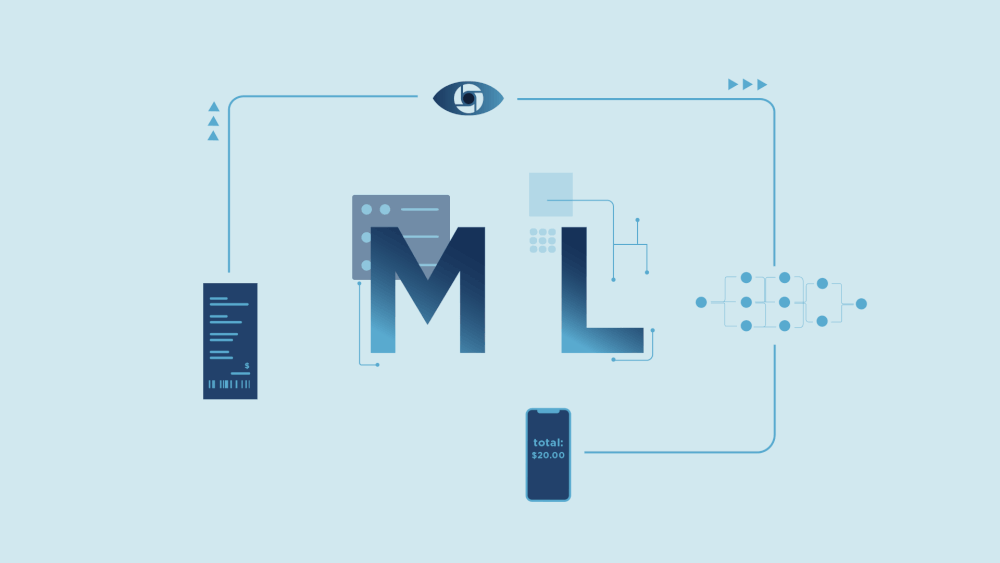

# 👋 Hi there! I'm Sid

Welcome to my GitHub!

I’m a robotics and computer vision engineer passionate about building intelligent perception systems, solving real-world challenges in autonomy, and enabling innovation through AI and embedded systems.

---
<!-- 🚀 Expertise Domains -->
<h2 align="center">🧠 My Expertise</h2>

<table align="center">
  <tr>
    <td align="center">
       
      <b> Robotics</b>
    </td>
    <td align="center">
       
      <b> Machine Learning</b>
    </td>
    <td align="center">
       
      <b>Computer Vision</b>
    </td>
    <td align="center">
       
      <b>Deep Learning</b>
    </td>
    <td align="center">
       
      <b>Artificial Intelligence</b>
    </td>
  </tr>
</table>

<!-- 🔍 Subdomains -->
<table align="center">
  <tr>
    <td align="center">
       
      <b>🛠Planning</b>
    </td>
    <td align="center">
       
      <b>Simulation</b>
    </td>
    <td align="center">
       
      <b>Detection</b>
    </td>
    <td align="center">
       
      <b>Tracking</b>
       </td>
    <td align="center">
       
      <b>GenAI</b>
    </td>
    </td>
    <td align="center">
       
      <b>Sensor Fusion</b>
    </td>
    <td align="center">
       
      <b>Edge AI</b>
    </td>
  </tr>
</table>

---

<!-- Row 1: Programming Languages -->
<h3 align="center">💻 Programming Languages</h3>

  
  
  

<!-- Row 2: Libraries & Frameworks -->
<h3 align="center">🧠 Frameworks & Libraries</h3>

  
  
  
  
  
  
  
  
  

<!-- Row 3: Tools & Deployment -->
<h3 align="center">🛠️ Developer Tools & Deployment</h3>

  
  
  
  
  
  
  
  

---

## 🚀 Projects

## 📂 Projects Categorized by Technology

### 🎯 3D Object Detection & Multi-Object Tracking
- [AB3DMOT_3D_Multi_Object_Tracking](https://github.com/sidshete/AB3DMOT_3D_Multi_Object_Tracking)  
  Multi-object tracking in 3D space using LiDAR and vision data for autonomous navigation.
- [FrustrumPointnet_object_detection_using_LiDAR_data](https://github.com/sidshete/FrustrumPointnet_object_detection_using_LiDAR_data)  
  3D object detection leveraging LiDAR data with Frustum PointNet architecture.
- [YOLOv3-Dectection-and-Tracking-with-Custom-Dataset](https://github.com/sidshete/YOLOv3-Dectection-and-Tracking-with-Custom-Dataset)  
  Real-time object detection and tracking with YOLOv3 on custom datasets.
- [Object-Tracking-using-OpenCV-](https://github.com/sidshete/Object-Tracking-using-OpenCV-)  
  Vision-based multi-object tracking implementation using OpenCV libraries.

### 🖼️ Instance & Anomaly Segmentation
- [instance_segmentation_using_Mask2Former](https://github.com/sidshete/instance_segmentation_using_Mask2Former)  
  Instance segmentation on images using the state-of-the-art Mask2Former model.
- [Oneformer_instance_segmentation_with_custom_dataset](https://github.com/sidshete/Oneformer_instance_segmentation_with_custom_dataset)  
  Training OneFormer architecture for instance segmentation on custom datasets.
- [anomaly_detection_and_segmentation_using_sam](https://github.com/sidshete/anomaly_detection_and_segmentation_using_sam)  
  Anomaly detection and segmentation leveraging Segment Anything Model (SAM).
- [instance_segmentation_with-custom_dataset_using_yolov8](https://github.com/sidshete/instance_segmentation_with-custom_dataset_using_yolov8)  
  Instance segmentation with YOLOv8 trained on custom data.

### 🤖 Robotics & Motion Planning
- [Robotics-Computational-Motion-Planning](https://github.com/sidshete/Robotics-Computational-Motion-Planning)  
  Algorithms and simulations for robotic motion planning in mobile platforms.
- [Aerial-Robotics](https://github.com/sidshete/Aerial-Robotics)  
  Robotics control and planning for aerial drones using MATLAB.

### 🧠 Synthetic Data Generation & Automation
- [synthetic_data_generation_with_prompts_for_object-text_insertion](https://github.com/sidshete/synthetic_data_generation_with_prompts_for_object-text_insertion)  
  Synthetic data generation pipeline for augmenting datasets by inserting text on objects.
- [Invisible_cloak](https://github.com/sidshete/Invisible_cloak)  
  Computer vision-based invisibility cloak using background subtraction.

### Generative AI
- [mcqgen](https://github.com/sidshete/mcqgen)  
  Automated generation of multiple-choice questions from datasets (private).

### 🏥 Detection
- [Detecting-COVID-19-with-Chest-X-Ray-using-PyTorch](https://github.com/sidshete/Detecting-COVID-19-with-Chest-X-Ray-using-PyTorch)  
  COVID-19 detection from chest X-ray images using deep learning.
- [Anomaly-detection-for-vision-based-obstacle-detection-in-automated-vehicles](https://github.com/sidshete/Anomaly-detection-for-vision-based-obstacle-detection-in-automated-vehicles)  
  Vision-based anomaly detection for autonomous vehicle obstacle detection.
- [Car-Pedestrian-Detection](https://github.com/sidshete/Car-Pedestrian-Detection)  
  Object detection system for cars and pedestrians in video streams.
- [Lane-Detection](https://github.com/sidshete/Lane-Detection)  
  Lane line detection using computer vision techniques on driving footage.

---

## 📫 Let’s Connect

- 🌐 [LinkedIn](https://www.linkedin.com/in/siddhant-shete/)
- 🌍 [Google Scholar]([https://yourwebsite.com](https://scholar.google.com/citations?hl=en&authuser=1&user=fZ225swAAAAJ))

  📨 Reach out for opportunities in robotics, computer vision, or embedded AI

---

Thanks for visiting! ⭐ Feel free to explore my projects or reach out for collaboration!
